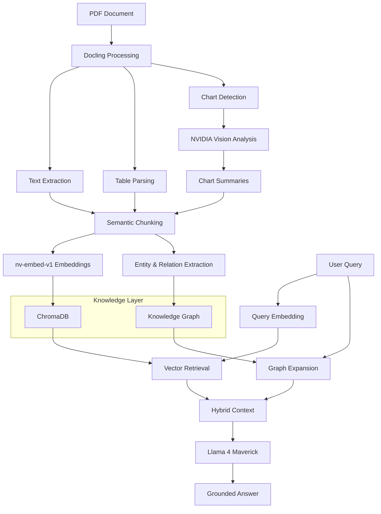

# Intelligent Unstructured Document Understanding Pipeline

```mermaid
flowchart TB

    PDF[PDF Document]

    PDF --> DOC[Docling Processing]

    DOC --> TEXT[Text Extraction]
    DOC --> TABLE[Table Parsing]
    DOC --> CHART[Chart Detection]

    CHART --> VLM[NVIDIA Vision Analysis]
    VLM --> SUMMARY[Chart Summaries]

    TEXT --> CHUNK[Semantic Chunking]
    TABLE --> CHUNK
    SUMMARY --> CHUNK

    CHUNK --> EMBED[nv-embed-v1 Embeddings]
    EMBED --> CHROMA[ChromaDB]

    CHUNK --> ENTITY[Entity & Relation Extraction]
    ENTITY --> GRAPH[Knowledge Graph]

    subgraph Knowledge Layer
        CHROMA
        GRAPH
    end

    QUERY[User Query]

    QUERY --> QEMBED[Query Embedding]

    QEMBED --> RETRIEVE[Vector Retrieval]
    CHROMA --> RETRIEVE

    QUERY --> GSEARCH[Graph Expansion]
    GRAPH --> GSEARCH

    RETRIEVE --> HYBRID[Hybrid Context]
    GSEARCH --> HYBRID

    HYBRID --> LLM[Llama 4 Maverick]

    LLM --> ANSWER[Grounded Answer]
```